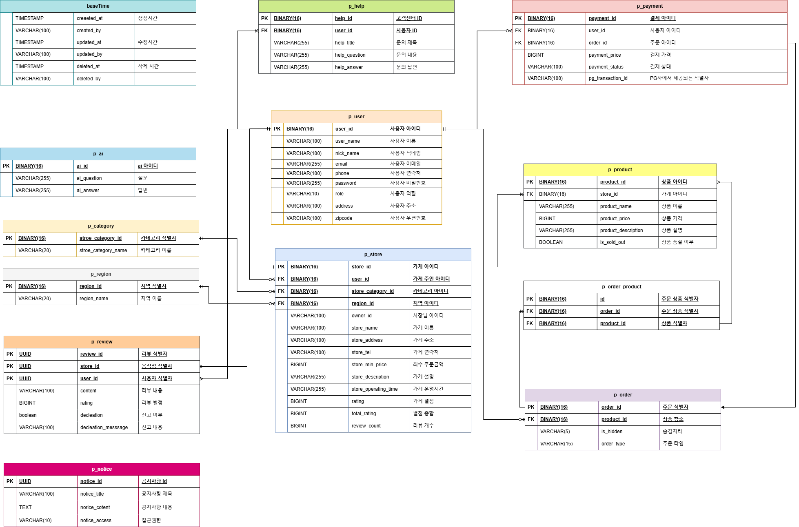

# Sparta Product - Delivery Service (1조)

## 팀원 역활분담

저희 팀은 각 팀원이 도메인별로 책임을 맡아 프로젝트를 진행했습니다. 각 팀원이 맡은 도메인은 다음과 같습니다.

- **김경민 (팀장)**
    - **담당 도메인**: 지역, 주문, 고객센터 
    - **역할**: 프로젝트 관리 및 조율, 지역 관리 시스템 개발, 주문 처리 로직 설계 및 구현, 고객센터 시스템 구축.

- **엄도원 (팀원)**
  - **담당 도메인**: 사용자, 결제, 카테고리, 공지사항
  - **역할**: 사용자 인증 및 관리 기능 개발, 결제 시스템 통합 및 처리, 카테고리 구조 설계, 공지사항 기능 구현.

- **윤선미 (팀원)**
  - **담당 도메인**: 상품, 가게, AI, 리뷰
  - **역할**: 상품 관리 시스템 개발, 가게 등록 및 관리 기능 구현, AI 기반 추천 시스템 개발, 리뷰 시스템 구축 및 관리.

## 서비스 구성 및 실행방법

### 서비스 구성

**백엔드**: Spring Boot를 사용한 RESTful API

**데이터베이스**: H2(dev), PostgreSQL(prod)

**배포**: AWS (EC2, RDS)

### 실행 방법

- git clone 진행
```markdown
git clone https://github.com/Order-Management-Platform/delivery-application.git
```

- 실행
    - IDE를 이용하여 실행
    - 또는 CLI 사용 시
    ```markdown
    ./gradlew bootRun
    ```

## 프로젝트 목적/상세

### 프로젝트 목적

**스프링 부트 기반의 모놀리식 어플리케이션 환경**에서 개발되는 **주문 관리 API 서버**입니다. 

이 서버는 권한을 통해 여러 서비스를 용도에 맞게 분리하여

사용자(고객, 가게 주인, 관리자)들이 상품을 효율적으로 주문하고, 주문 상태를 조회 및 취소 등 원활한 서비스를 제공하는 것을 목표로 합니다. 

'OO의 민족'과 같은 주문 관리 시스템을 모델로 하여, 사용자의 주문 경험을 최적화하고 관리 효율성을 극대화하는 것이 핵심입니다.

### 프로젝트 상세

- **사용자 관리**: 회원 가입, 로그인, 프로필 관리.
- **지역 관리**: 가게를 지역 별로 구분하여 관리.
- **가게 관리**: 가게 정보 수정 및 상세 조회.
- **상품 관리**: 가게 별로 상품 생성, 조회, 수정 및 숨김 처리.
- **주문 관리**: 주문 생성, 상태 조회, 수정 및 취소.
- **결제 시스템**: 결제 요청, 결제 확인 및 결제 내역 조회.
- **고객 지원**: 고객 문의 접수 및 답변 제공.
- **공지사항**: 권한에 따라 공지사항 게시 및 관리.
- **리뷰 및 평점**: 가게 별로 리뷰 작성 및 평점 제공.

## ERD



## **기술 스택**

### **백엔드**
- **Java** (Spring Boot)
- **Spring Data JPA** (데이터 접근 계층)
- **H2** (개발 데이터베이스)
- **PostgreSQL** (프로덕션 데이터베이스)
- **Spring Security** (애플리케이션 보안)
- **JWT** (인증)
- **Redis** (캐싱)

### **DevOps**
- **AWS**
  - EC2 (서버)
  - RDS (데이터베이스)

### **기타**
- **Git** (버전 관리)
- **Postman** (API 테스트)

## API Docs

- [API Docs](https://little-pillow-4e0.notion.site/API-v-3-0-0-03c3aa6cdcd045ccb3f78edc6b09da48?pvs=4)
